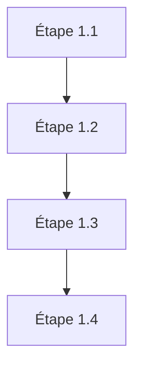
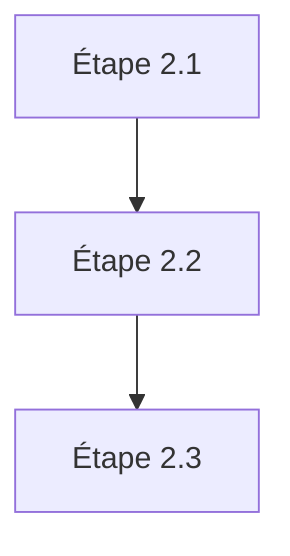
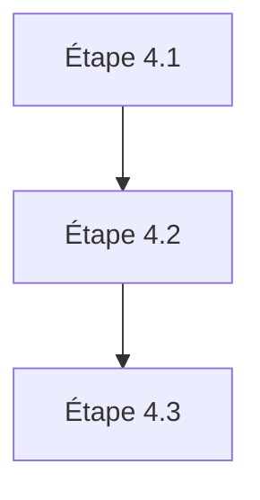

# Plan d'action - Développement Application Nettoyeur CSV

## Phase 1 : Structure de base et configuration


### Étape 1.1 : Configuration initiale
- Créer la structure des dossiers
- Configurer ESLint et Prettier
- Mettre en place le fichier de configuration
- Documentation des constantes
- Taille estimée : 5K tokens

### Étape 1.2 : HTML de base
- Structure HTML5 sémantique
- Liens CSS/JS
- Métadonnées
- Taille estimée : 3K tokens

### Étape 1.3 : CSS fondamental
- Reset CSS
- Variables CSS
- Classes utilitaires
- Layout de base
- Taille estimée : 7K tokens

### Étape 1.4 : JavaScript initial
- Structure modules ES6
- Configuration types JSDoc
- Classe principale App
- Taille estimée : 10K tokens

## Phase 2 : Gestion de l'authentification


### Étape 2.1 : Interface Bearer Token
- Composant input sécurisé
- Validation locale
- Stockage temporaire
- Taille estimée : 8K tokens

### Étape 2.2 : API Client
- Classe DragonflyAPI
- Gestion des erreurs
- Tests unitaires
- Taille estimée : 12K tokens

### Étape 2.3 : UI Authentification
- Feedback utilisateur
- Gestion des états
- Messages d'erreur
- Taille estimée : 7K tokens

## Phase 3 : Traitement CSV


### Étape 3.1 : Zone de dépôt
- Drag & Drop
- Validation fichiers
- Retour visuel
- Taille estimée : 10K tokens

### Étape 3.2 : Parser CSV
- Classe CSVHandler
- Détection séparateurs
- Validation structure
- Taille estimée : 15K tokens

### Étape 3.3 : Prévisualisation
- Table dynamique
- Pagination
- Styles responsifs
- Taille estimée : 12K tokens

## Phase 4 : Intégration IA


### Étape 4.1 : Service IA
- Classe AIService
- File d'attente requêtes
- Gestion rate limiting
- Taille estimée : 15K tokens

### Étape 4.2 : Nettoyage données
- Règles de nettoyage
- Validation résultats
- Transformation données
- Taille estimée : 20K tokens

### Étape 4.3 : Progression
- Barre progression
- Statistiques temps réel
- Log des opérations
- Taille estimée : 8K tokens

## Phase 5 : Export et finitions


### Étape 5.1 : Export CSV
- Génération fichier
- Encodage correct
- Download automatique
- Taille estimée : 10K tokens

### Étape 5.2 : UI/UX finale
- Animations
- États interactifs
- Messages utilisateur
- Taille estimée : 12K tokens

### Étape 5.3 : Documentation
- JSDoc complet
- README
- Guide utilisation
- Taille estimée : 8K tokens

## Instructions par étape

Chaque étape devra suivre ce template :
```markdown
# Étape X.X : [Nom]

## Objectif
[Description claire de l'objectif]

## Fichiers concernés
- chemin/vers/fichier1.js
- chemin/vers/fichier2.css

## Dépendances
- liste des dépendances

## Tests requis
- liste des tests à implémenter

## Documentation
- points à documenter

## Critères de validation
- liste des critères
```

## Bonnes pratiques à respecter

### JavaScript
- ES6+ modules
- Async/await
- Types JSDoc
- Tests unitaires
- Gestion erreurs

### CSS
- BEM methodology
- Variables CSS
- Mobile-first
- A11y

### Sécurité
- Validation entrées
- Sanitization données
- CORS
- CSP

### Performance
- Lazy loading
- Debouncing
- Memory management
- Bundle optimization

Ce découpage permet à un LLM de :
1. Comprendre chaque étape isolément
2. Générer du code cohérent
3. Maintenir le contexte
4. Produire une documentation cohérente

Chaque étape est autonome mais s'intègre dans l'ensemble.