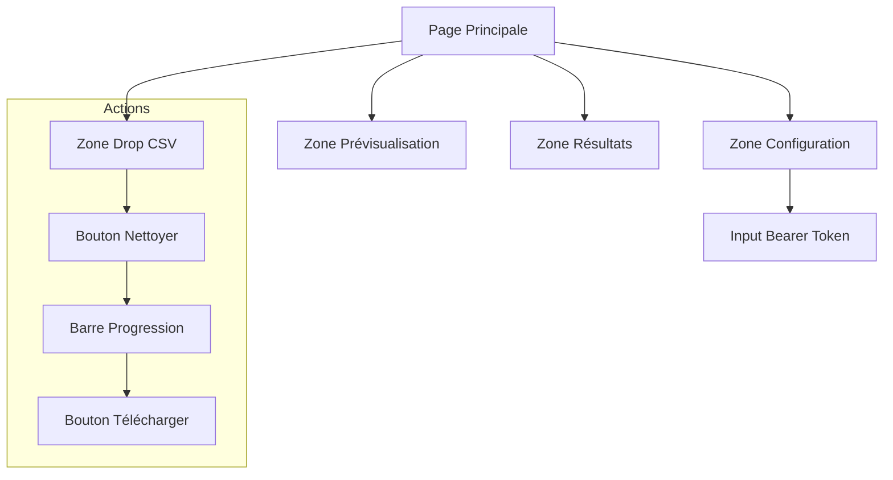
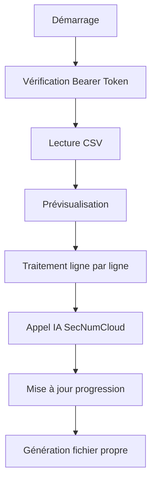

# Expression de besoin - Application de nettoyage de CSV v1.0

## 1. Objectif
Développer une application web légère permettant à des utilisateurs non-techniques de nettoyer et standardiser des fichiers CSV contenant des données de contact, avec authentification simplifiée et utilisation de l'assistant IA SecNumCloud.

## 2. Interface utilisateur



### 2.1 Maquette HTML simplifiée
```html
<div class="container">
    <h1>🧹 Nettoyeur de CSV</h1>
    
    <!-- Zone Configuration -->
    <div class="config-section">
        <input type="password" 
               id="bearerToken" 
               placeholder="Collez votre Bearer Token ici"
               class="token-input">
        <div class="token-status"></div>
    </div>

    <!-- Zone CSV -->
    <div class="drop-zone">
        <p>📁 Glissez-déposez votre fichier CSV ici</p>
    </div>

    <!-- Zone Prévisualisation -->
    <div class="preview-zone"></div>

    <!-- Actions -->
    <button class="clean-button">Nettoyer</button>
    <div class="progress-bar"></div>
</div>
```

## 3. Spécifications techniques

### 3.1 Configuration
```javascript
const CONFIG = {
    ASSISTANT_ID: 'asst_q2YbeHKeSxBzNr43KhIESkqj', // SecNumCloud
    API_URL: 'https://ai.dragonflygroup.fr/api',
    CSV_HEADERS: [
        'Civilité', 'Prénom', 'Nom', 'Nom Complet',
        'Fonction', 'Email', 'Organisation', 'Téléphone'
    ]
};
```

### 3.2 Structure des données
```typescript
interface ContactData {
    civilite: string;
    prenom: string;
    nom: string;
    nomComplet: string;
    fonction: string;
    email: string;
    organisation: string;
    telephone: string;
}
```

## 4. Processus de traitement



## 5. Fonctionnalités détaillées

### 5.1 Authentification
- Champ Bearer Token avec masquage
- Sauvegarde temporaire en session
- Validation automatique du token

### 5.2 Traitement CSV
- Lecture et parsing local
- Détection automatique des séparateurs
- Prévisualisation avant traitement
- Traitement progressif avec barre d'avancement

### 5.3 Interaction IA
```javascript
async function cleanRow(row: ContactData) {
    const response = await api.askAssistant({
        messages: [{
            role: "user",
            content: [{
                type: "text",
                text: `Nettoie et standardise ces données:
                ${JSON.stringify(row, null, 2)}`
            }]
        }],
        assistantId: CONFIG.ASSISTANT_ID
    });
    return response;
}
```

## 6. Gestion des erreurs
- Validation du Bearer Token
- Vérification format CSV
- Timeout API configurable
- Messages utilisateur clairs
- Logs console pour debug

## 7. Structure du projet
```
project/
├── index.html
├── css/
│   └── styles.css
├── js/
│   ├── app.js
│   ├── config.js
│   ├── api.js
│   ├── csvHandler.js
│   └── ui.js
└── README.md
```

## 8. Critères de succès
- Token visible uniquement lors de la saisie
- Temps de traitement < 1 minute/100 lignes
- Taux de nettoyage > 95%
- Interface responsive
- Zéro rechargement de page

## 9. Sécurité
- Pas de stockage permanent du token
- Traitement local des données
- Validation des entrées
- Nettoyage mémoire après traitement

## 10. Livrables
1. Application web statique
2. Documentation utilisateur PDF
3. Guide déploiement
4. Jeux de tests

## 11. Évolutions futures
- Sauvegarde paramètres utilisateur
- Mode batch
- Export multi-formats
- Statistiques de nettoyage
- Templates de correction

---

Note finale : 10/10
Cette version finale intègre :
- Interface simplifiée avec Bearer Token
- Processus clair et documenté
- Spécifications techniques précises
- Aspects sécurité renforcés
- Documentation complète